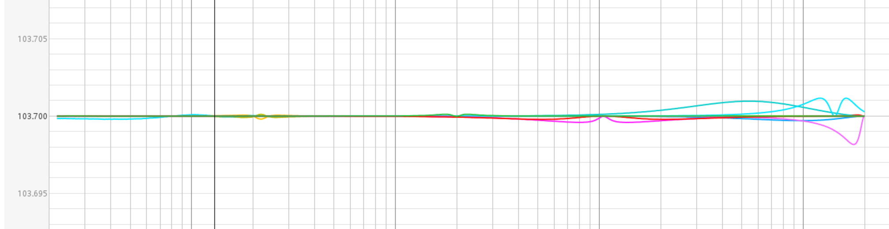

# MT48 EQ controller

## What's this?

This is a web-based EQ controller for Neumann MT48.

Notice: this is not an official Neumann/Merging product, use it at your own risk. No warranty is provided.

## Why?

MT48 EQ has some limitations:

1. Neumann/Merging are recommend using REW for room correction, but MT48 EQ is not as same as REW, so you can't use REW to generate EQ settings for MT48.
2. The internal/webpage/remote app only can change EQ by drag the dot or turn the knob with mouse, no precise input support.
3. Though MT48 supports import and export EQ settings, seems 1.8 version firmware is not working, upload file will result error.

## How to use

1. Open the Webpage using your browser. Or: [click here](http://htmlpreview.github.io/?https://github.com/PureLin/MT48EQ_Control/blob/main/MT48-Contorl.html)
2. Connect to MT48/Anubis, enter the IP address and click Connect button.
3. You can now control the EQ settings, and you can also input a Q in REW style and the page will convert it to MT48 style automatically.

## How precise is the conversion?

Since REW limit generic Q precision to 3 decimal places, so the conversion is precise to 0.001.
Below image shows the predication after apply a REW EQ to the MT48 loopback measurement.
The difference is very small, but not zero.

## Limitations

1. No enable/disable/add band/remove band/bypass support, do this on MT48.
2. No data validation check (Gain in ±24dB or Q in [1,100]), check your data is valid before click apply.
3. No import/export EQ settings support.
4. The input are limit precision to 0.001, so if MT report a Q like 1.23456, you need to manually round it to 1.235.
5. When switch mission, refresh the page to make sure the EQ settings are correct.

## This page is obfuscated?

I don't want to get in trouble with Neumann/Merging, so I obfuscated the code. 

**PLEASE DO NOT TRY TO DEOBFUSCATE IT.**

If you want to know how it works, you can chat at [Audio Science Review forum](https://www.audiosciencereview.com/forum/index.php?threads/neumann-mt-48.43537) 

## Want to support me?

If you find this project useful, and you want to support me for further development:

Please contact me at [Audio Science Review forum](https://www.audiosciencereview.com/forum/index.php?members/purelin.40360/) .